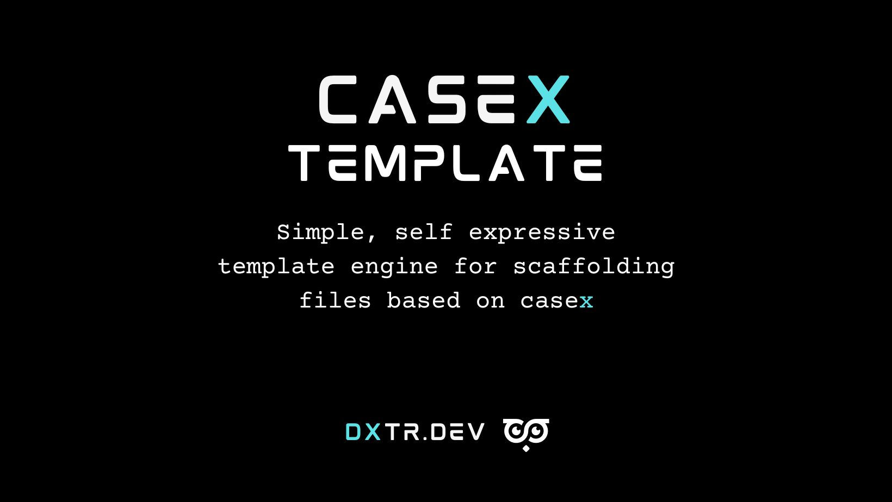

<p align="center">
  
</p>

<p align="center">
  Simple, self expressive template engine for scaffolding files based on <a href="https://dx.dev/casex">casex</a>.
</p>

<p align="center">
  <a href="https://www.npmjs.org/@dxtr.dev/casex-template"></a>
  <a href="https://github.com/dxtr-dot-dev/casex-template/actions"></a>
  <a href="https://codeclimate.com/github/dxtr-dot-dev/casex-template/maintainability"></a>
  <a href="https://www.npmjs.org/@dxtr.dev/casex-template"></a>
</p>

## Brought to you by [DXTR.DEV](https://dxtr.dev)

DXTR was founded to create tools and apps that improve developer experience and productivity.

If you like this project, consider checking out our other apps and tools at [https://dxtr.dev](https://dxtr.dev).

## About Casex Template

Casex Template is a simple template engine that applies [the casex pattern](https://dx.dev/casex) to all occurances in a template.

Often creating templates feels tedious and time consuming, we wanted to create an engine that lets you pretty much copy an example file, replace a few `__name__` patterns and you should be good to go.

Here's a simple example of what a template might look like:

```tsx
// __na-me__-page.ts

type __NaMe__PageProps {
  _naMe_s: _NaMe_[]
}

export function __NaMe__Page({ _naMe_s }: __NaMe__PageProps) {
  return (
    <div>
      <header>
        Hello there - this file was scaffolded.
      </header>

      <div>
        Here's the list of _na me_s you've given me: {JSON.stringify(_naMe_s)}
      </div>
    </div>
  );
}
```

And if we apply the name `foo bar` it becomes:

```tsx
// foo-bar-page.ts

type FooBarPageProps {
  fooBars: FooBar[]
}

export function FooBarPage({ fooBars }: FooBarPageProps) {
  return (
    <div>
      <header>
        Hello there - this file was scaffolded.
      </header>

      <div>
        Here's the list of foo bars you've given me: {JSON.stringify(fooBars)}
      </div>
    </div>
  );
}
```

## Documentation

The full documentation is available at [dxtr.dev/casex-template](dxtr.dev/casex-template)

## Previous versions

Casex Template 2.x is not compatible previous versions. If you need previous docs please refer to:

- [v1.x](https://github.com/dxtr-dot-dev/casex-template/tree/1.x)

## License

Casex Template is open-sourced software licensed under the [MIT License](./LICENSE.md).
